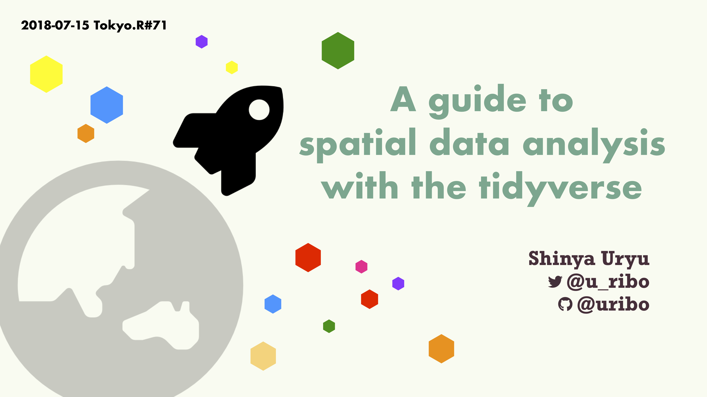
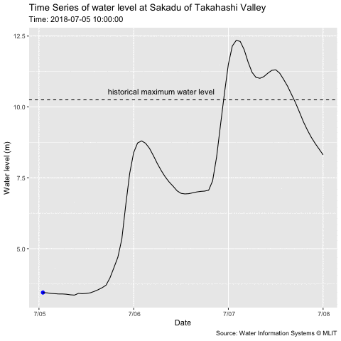

Tokyo.R#71
====================

Presentaion and suporting materials for [Tokyo.R#71](https://tokyor.connpass.com/event/92522/).

## Slide

Slides on [SpeakerDeck](https://speakerdeck.com/s_uryu/rspatial-with-tidyverse-tokyor71).




And also slides as PDF file [here](slide.pdf).




## Source code

```
src/
  |- 01-introduction_sf.R
  |- 02-sf_and_tidyverse.R
```

## Session Information

```r
sessioninfo::session_info()

─ Session info ────────────────────────────────────────────────────────────────────────────
 setting  value                       
 version  R version 3.5.0 (2018-04-23)
 os       macOS High Sierra 10.13.6   
 system   x86_64, darwin15.6.0        
 ui       RStudio                     
 language En                          
 collate  ja_JP.UTF-8                 
 tz       Asia/Tokyo                  
 date     2018-07-18                  

─ Packages ────────────────────────────────────────────────────────────────────────────────
 package       * version    date       source                               
 abind         * 1.4-5      2016-07-21 CRAN (R 3.5.0)                       
 assertthat      0.2.0      2017-04-11 CRAN (R 3.5.0)                       
 backports       1.1.2      2017-12-13 CRAN (R 3.5.0)                       
 base64enc       0.1-3      2015-07-28 CRAN (R 3.5.0)                       
 bindr           0.1.1      2018-03-13 CRAN (R 3.5.0)                       
 bindrcpp      * 0.2.2      2018-03-29 CRAN (R 3.5.0)                       
 broom           0.4.5      2018-07-03 CRAN (R 3.5.0)                       
 cellranger      1.1.0      2016-07-27 CRAN (R 3.5.0)                       
 class           7.3-14     2015-08-30 CRAN (R 3.5.0)                       
 classInt        0.2-3      2018-04-16 CRAN (R 3.5.0)                       
 cli             1.0.0      2017-11-05 CRAN (R 3.5.0)                       
 clisymbols      1.2.0      2017-05-21 CRAN (R 3.5.0)                       
 codetools       0.2-15     2016-10-05 CRAN (R 3.5.0)                       
 colorspace      1.3-2      2016-12-14 CRAN (R 3.5.0)                       
 crayon          1.3.4      2017-09-16 CRAN (R 3.5.0)                       
 crosstalk       1.0.0      2016-12-21 CRAN (R 3.5.0)                       
 DBI             1.0.0      2018-05-02 CRAN (R 3.5.0)                       
 devtools        1.13.6     2018-06-27 CRAN (R 3.5.0)                       
 digest          0.6.15     2018-01-28 CRAN (R 3.5.0)                       
 dplyr         * 0.7.6      2018-06-29 CRAN (R 3.5.0)                       
 e1071           1.6-8      2017-02-02 CRAN (R 3.5.0)                       
 fansi           0.2.3      2018-05-06 CRAN (R 3.5.0)                       
 farver          1.0        2018-07-14 Github (thomasp85/farver@d29b48c)    
 forcats       * 0.3.0      2018-02-19 CRAN (R 3.5.0)                       
 foreach         1.4.4      2017-12-12 CRAN (R 3.5.0)                       
 foreign         0.8-70     2017-11-28 CRAN (R 3.5.0)                       
 gdalUtils       2.0.1.14   2018-04-23 CRAN (R 3.5.0)                       
 gdtools         0.1.7      2018-02-27 CRAN (R 3.5.0)                       
 gganimate     * 0.9.9.9999 2018-07-14 Github (thomasp85/gganimate@13a9a29) 
 ggforce       * 0.1.3      2018-07-07 CRAN (R 3.5.0)                       
 ggplot2       * 3.0.0      2018-07-03 CRAN (R 3.5.0)                       
 ggrepel         0.8.0      2018-05-09 CRAN (R 3.5.0)                       
 glue            1.2.0.9000 2018-07-13 Github (tidyverse/glue@1d102ad)      
 gtable          0.2.0      2016-02-26 CRAN (R 3.5.0)                       
 haven           1.1.2      2018-06-27 CRAN (R 3.5.0)                       
 here            0.1        2017-05-28 CRAN (R 3.5.0)                       
 hms             0.4.2      2018-03-10 CRAN (R 3.5.0)                       
 htmltools       0.3.6      2017-04-28 CRAN (R 3.5.0)                       
 htmlwidgets     1.2        2018-04-19 CRAN (R 3.5.0)                       
 httpuv          1.4.4.2    2018-07-02 CRAN (R 3.5.0)                       
 httr            1.3.1      2017-08-20 CRAN (R 3.5.0)                       
 iterators       1.0.10     2018-07-13 CRAN (R 3.5.0)                       
 jmastats      * 0.0.0.9000 2018-07-13 git (@a90e3a3)                       
 jpmesh        * 1.1.1.9000 2018-06-26 local (uribo/jpmesh@5054663)         
 jpndistrict   * 0.3.2      2018-06-14 CRAN (R 3.5.0)                       
 jsonlite        1.5        2017-06-01 CRAN (R 3.5.0)                       
 knitr           1.20       2018-02-20 CRAN (R 3.5.0)                       
 labeling        0.3        2014-08-23 CRAN (R 3.5.0)                       
 later           0.7.3      2018-06-08 CRAN (R 3.5.0)                       
 lattice         0.20-35    2017-03-25 CRAN (R 3.5.0)                       
 lazyeval        0.2.1      2017-10-29 CRAN (R 3.5.0)                       
 leaflet         2.0.1      2018-06-04 CRAN (R 3.5.0)                       
 lpSolve         5.6.13     2015-09-19 CRAN (R 3.5.0)                       
 lubridate       1.7.4      2018-04-11 CRAN (R 3.5.0)                       
 lwgeom          0.1-4      2018-01-28 CRAN (R 3.5.0)                       
 magick          1.9        2018-05-11 CRAN (R 3.5.0)                       
 magrittr        1.5        2014-11-22 CRAN (R 3.5.0)                       
 mapview       * 2.4.0      2018-04-28 CRAN (R 3.5.0)                       
 MASS            7.3-50     2018-04-30 CRAN (R 3.5.0)                       
 memoise         1.1.0      2018-07-13 Github (hadley/memoise@06d16ec)      
 mime            0.5        2016-07-07 CRAN (R 3.5.0)                       
 miniUI          0.1.1.1    2018-05-18 CRAN (R 3.5.0)                       
 mnormt          1.5-5      2016-10-15 CRAN (R 3.5.0)                       
 modelr          0.1.2      2018-05-11 CRAN (R 3.5.0)                       
 munsell         0.5.0      2018-06-12 CRAN (R 3.5.0)                       
 nlme            3.1-137    2018-04-07 CRAN (R 3.5.0)                       
 patchwork       0.0.1      2018-07-14 Github (thomasp85/patchwork@7fb35b1) 
 pillar          1.3.0      2018-07-14 CRAN (R 3.5.0)                       
 pkgconfig       2.0.1      2017-03-21 CRAN (R 3.5.0)                       
 plyr            1.8.4      2016-06-08 CRAN (R 3.5.0)                       
 png             0.1-7      2013-12-03 CRAN (R 3.5.0)                       
 prettyunits     1.0.2      2015-07-13 CRAN (R 3.5.0)                       
 progress        1.2.0      2018-06-14 CRAN (R 3.5.0)                       
 promises        1.0.1      2018-04-13 CRAN (R 3.5.0)                       
 psych           1.8.4      2018-05-06 CRAN (R 3.5.0)                       
 purrr         * 0.2.5      2018-05-29 CRAN (R 3.5.0)                       
 R.methodsS3     1.7.1      2016-02-16 CRAN (R 3.5.0)                       
 R.oo            1.22.0     2018-04-22 CRAN (R 3.5.0)                       
 R.utils         2.6.0      2017-11-05 CRAN (R 3.5.0)                       
 R6              2.2.2      2017-06-17 CRAN (R 3.5.0)                       
 raster        * 2.6-7      2017-11-13 CRAN (R 3.5.0)                       
 Rcpp            0.12.17    2018-05-18 CRAN (R 3.5.0)                       
 readr         * 1.1.1      2017-05-16 CRAN (R 3.5.0)                       
 readxl          1.1.0      2018-04-20 CRAN (R 3.5.0)                       
 reshape2        1.4.3      2017-12-11 CRAN (R 3.5.0)                       
 rgdal           1.3-3      2018-06-22 CRAN (R 3.5.0)                       
 rlang           0.2.1      2018-05-30 CRAN (R 3.5.0)                       
 rnaturalearth   0.1.0      2017-03-21 CRAN (R 3.5.0)                       
 rprojroot       1.3-2      2018-01-03 CRAN (R 3.5.0)                       
 rstudioapi      0.7        2017-09-07 CRAN (R 3.5.0)                       
 rvest           0.3.2      2016-06-17 CRAN (R 3.5.0)                       
 satellite       1.0.1      2017-10-18 CRAN (R 3.5.0)                       
 scales          0.5.0.9000 2018-05-07 Github (hadley/scales@d767915)       
 scico           1.0.0      2018-07-17 Github (thomasp85/scico@5c67666)     
 sessioninfo     1.0.0      2017-06-21 CRAN (R 3.5.0)                       
 sf            * 0.6-3      2018-05-17 CRAN (R 3.5.0)                       
 shiny           1.1.0      2018-05-17 CRAN (R 3.5.0)                       
 sp            * 1.3-1      2018-06-05 CRAN (R 3.5.0)                       
 spData          0.2.9.0    2018-06-17 CRAN (R 3.5.0)                       
 stars         * 0.1-1      2018-07-13 Github (r-spatial/stars@c9af832)     
 stringi         1.2.3      2018-06-12 CRAN (R 3.5.0)                       
 stringr       * 1.3.1      2018-05-10 CRAN (R 3.5.0)                       
 svglite         1.2.1      2017-09-11 CRAN (R 3.5.0)                       
 tibble        * 1.4.2      2018-01-22 CRAN (R 3.5.0)                       
 tidyr         * 0.8.1      2018-05-18 CRAN (R 3.5.0)                       
 tidyselect      0.2.4      2018-02-26 CRAN (R 3.5.0)                       
 tidyverse     * 1.2.1      2017-11-14 CRAN (R 3.5.0)                       
 transformr      0.1.0      2018-07-14 Github (thomasp85/transformr@f163c57)
 tweenr          0.1.5.9999 2018-07-14 Github (thomasp85/tweenr@4d4f8d1)    
 units           0.6-0      2018-06-09 CRAN (R 3.5.0)                       
 utf8            1.1.4      2018-05-24 CRAN (R 3.5.0)                       
 viridisLite     0.3.0      2018-02-01 CRAN (R 3.5.0)                       
 webshot         0.5.0      2017-11-29 CRAN (R 3.5.0)                       
 withr           2.1.2      2018-03-15 CRAN (R 3.5.0)                       
 xml2            1.2.0      2018-01-24 CRAN (R 3.5.0)                       
 xtable          1.8-2      2016-02-05 CRAN (R 3.5.0) 
```
